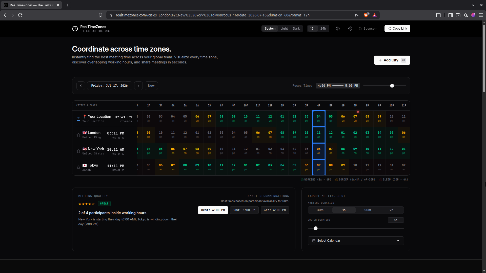
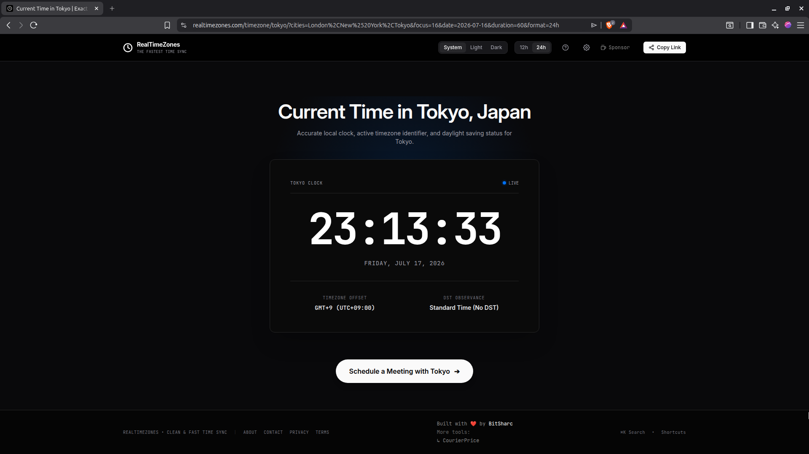
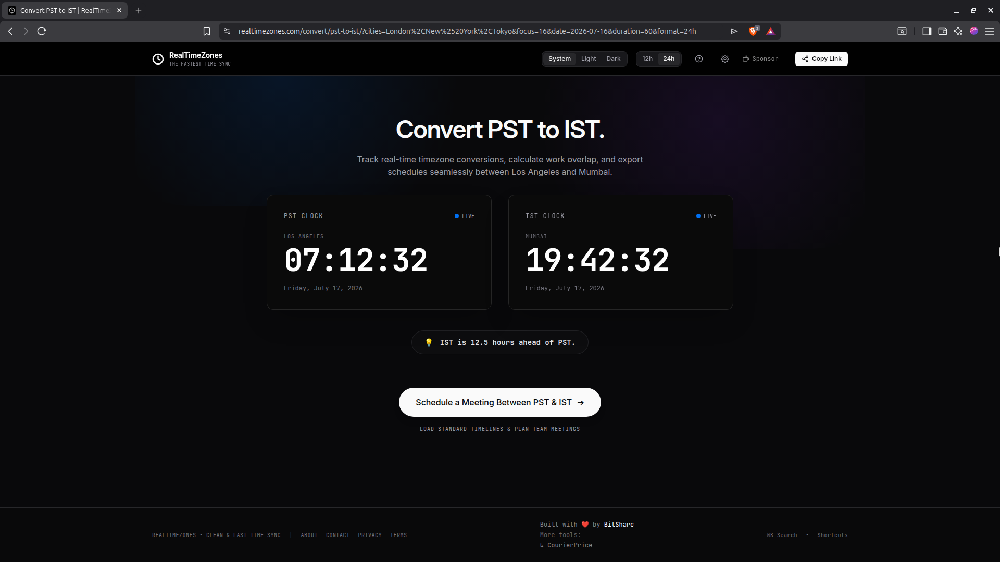

# 🌍 RealTimeZones

### Plan meetings across time zones without the mental math.

  

  
  
  
  

---

## 🖼️ Overview

Planning meetings across multiple countries shouldn't require juggling clocks or calculating time differences.

RealTimeZones helps you compare time zones instantly, visualize overlapping working hours, and find the perfect meeting time in seconds.

  <a href="https://github.com/user-attachments/assets/ed67f7b8-8f92-44f9-95d7-1332aa14a5eb">
    <strong>▶️ Watch the 22-Second Product Demo</strong>
  </a>

---

## 💡 Why I Built It

Scheduling meetings across different time zones is surprisingly frustrating.

Most tools either focus on converting a single time or require multiple manual inputs before you can compare schedules.

I wanted a faster, more visual solution where users could instantly compare multiple cities, explore working-hour overlaps, and confidently schedule meetings without the mental math.

---

## ✨ Features

- 🌍 Compare multiple time zones simultaneously
- 🕒 Real-time clocks
- 🤝 Working-hour overlap visualization
- ⚡ Instant timezone conversion
- 🏙️ City-based search
- 📱 Fully responsive design
- 🌙 Light & Dark mode
- 🚀 Fast client-side performance

---

## 📸 Screenshots

### 🌆 Time Zone Comparison

---

### 🔄 Time Conversion

---

## 🛠 Tech Stack

- **Framework:** Astro
- **Language:** TypeScript
- **Styling:** Tailwind CSS
- **Deployment:** Cloudflare Pages
- **Time API:** JavaScript Intl API

---

## 🚀 Roadmap

- Google Calendar integration
- Outlook Calendar support
- Shareable meeting links
- Saved meeting schedules
- Team collaboration
- More customization options

---

## 🌐 Live Website

**https://realtimezones.com**

---

## 💬 Feedback

Suggestions, bug reports, and feature requests are always welcome.

If RealTimeZones helped you, consider leaving a ⭐ on the repository.

---

### 👨‍💻 Built by Tushar Chib (BitSharC)

Making global collaboration a little easier, one meeting at a time.

